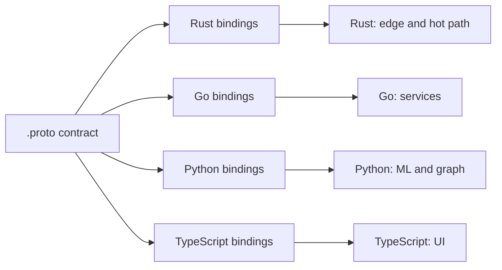

# QPMatrix

**An engineering studio building AI-native systems — polyglot by conviction, contract-first by design.**

We design and ship production services the way we'd want to inherit them:
the public shape of every system comes from a single source of truth, the
language is chosen per job instead of per habit, and nothing merges without
proving itself against the same gate a human would have to pass. This page
is the front door — [qpmatrix.tech](https://qpmatrix.tech) has the rest.

## Engineering principles

This is less a stack and more a set of standing decisions. They're the
actual differentiator, so here they are plainly:

- **Contract-first.** Protobuf is the source of truth for every service
  boundary. Clients and servers in every language are generated from the
  same `.proto`, never hand-copied between them — the contract can't drift
  out from under the code that implements it.
- **Polyglot by design, not by accident.** Rust for edges and hot paths,
  Go for services, Python for ML and graph work, TypeScript for UI only.
  Each language earns its place for a specific job; none of them is the
  default.
- **One repo, one package.** No monorepos, no mixed languages sharing a
  checkout. A package stands alone, versions alone, and is reviewed alone.
- **Every repo is gate-enforced.** Format, lint, tests, and security run
  as the exact same command locally and in CI — the gate that blocks a
  laptop commit is the gate that blocks a merge, with no separate "CI-only"
  rules.
- **Observability-first.** Every service ships traced, metered, and
  alerted from day one. A check counts as proven when something was
  actually killed to watch it fire — not when a dashboard looks green.
- **AI-agent-driven delivery, cross-family reviewed.** Most day-to-day
  implementation work is done by AI agent seats. Every change is
  independently reviewed by a *different* AI model family before it can
  merge, and only merges on a green CI run. It's an unusual way to build,
  and we're confident enough in the discipline behind it to say so plainly.

## The qpm package family

Shared, reusable building blocks that every service we build draws from
instead of reinventing. The packages themselves are private; what they do
isn't:

| Package | Purpose |
|---|---|
| `qpm-go-service` | Go service scaffolding — bootstrap, config, health checks, graceful shutdown, wired the same way everywhere. |
| `qpm-go-cache` | A typed caching layer for Go services, with pluggable backends behind one interface. |
| `qpm-go-telemetry` | Tracing, metrics, and structured logging for Go services, wired to the contract-first observability model. |
| `qpm-rs-service` | Rust service scaffolding for edge and hot-path workloads where latency is the spec. |
| `qpm-rs-ratelimit` | Rate-limiting primitives for Rust services — the shared defense against noisy neighbors. |
| `qpm-ui` *(upcoming)* | A shared component library for TypeScript frontends. |
| `qpm-ts-client-core` *(upcoming)* | A typed client core generated straight from proto contracts, for TypeScript consumers. |

## How a contract becomes four languages

The shape of a service is drawn once and generated everywhere it's
consumed:

## Tech stack

## Contact

[qpmatrix.tech](https://qpmatrix.tech) · [hasan@qpmatrix.tech](mailto:hasan@qpmatrix.tech)
